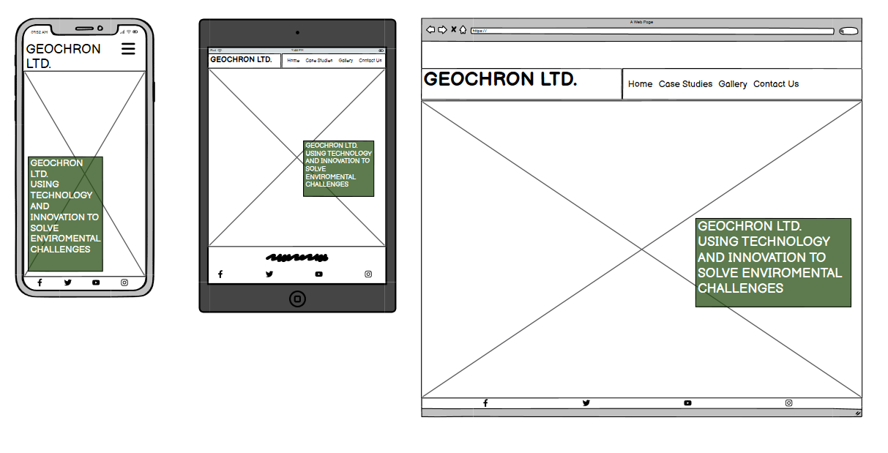
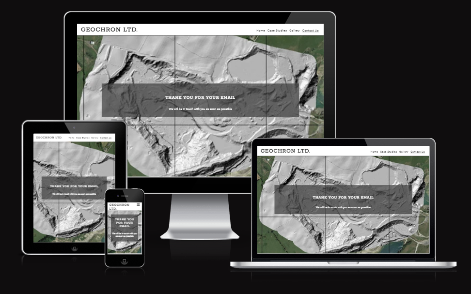

# Geochron Ltd.

Visit the deployed site here : [Geochron Ltd.](https://markcrowleyx.github.io/Portfolio-1/)

Founded in 2015 by Dr Quentin Crowley, Geochron is a spin-out company from a research project in Trinity College Dublin. Geochron now offers a range of innovative environmental solutions, and is the first company offering customised remote sensing surveys of quarries in Ireland.

## Our Purpose
Integrating technology and innovation to provide solutions to environmental challenges.

## Services
Geochron Ltd offers a range of customised remote sensing services. Using state of the art drone technology and a range of sensors, our surveys incorporate:

- High-resolution orthorectified images. Aerial images are stitched together, and corrected for any distortion, to produce a detailed and interactive true colour image of the survey area.
- Three dimensional models. 3D models are generated from lidar (laser scanner) point clouds, or from 2D images. 3D models include digital elevation model (DEM), digital surface model (DSM), and customized 3D maps.
- Gamma spectrometry. Using specially developed gamma detectors, outputs include gamma dose rate, and concentrations of potassium (K), uranium (U), and thorium (Th). Gamma spectrometry outputs can be integrated into 3D models.

## Project
### Safe and sustainable supply of building materials

Funded by a European Open Science Cloud (EOSC) Futures grant administered by GÉANT, Geochron was awarded an EU tender to conduct a survey of representative quarries supplying building materials in Ireland. 

### Applications

The project outputs serve as a unique and valuable resource for scientific research with a range of different applications, including:

- Resource Management.
- Land Use Planning.
- Geological Research.
- Environmental Studies.
- Radiation Protection.
---
## CONTENTS

- [User Experience (UX)](#user-experience---ux)
  - [Initial Discussion](#initial-discussion)
  - [User stories](#user-stories)
- [Design](#design)
  - [Colour Scheme](#colour-scheme)
  - [Typography](#typography)
  - [Imagery](#imagery)
  - [Wireframes](#wireframes)
- [Features](#features)
  - [General Features on Each Page](#general-features-on-each-page)
    - [Landing Page](#landing-page)
    - [Case Studies Page](#case-studies-page)
    - [Gallery](#gallery-page)
    - [Contact Page](#contact-page)
  - [Future Features](#future-features)
- [Accessibility](#accessibility)
- Technologies used

  - Languages Used
  - Frameworks, Libraries & Programs Used

- [Deployment](#deployment)
  
    - [Local Development](#local-development)
    - [How to Fork](#how-to-fork)
    - [How to Clone](#how-to-clone)

- [Testing](#testing)

- Credits
  - Code used
  - Content
  - Media
  - Acknowledgements

---

## User Experience - UX

### Initial Discussion

#### Key information for the site

- An introduction to Geochron Ltd.
- Details about the Quarry Survey Project.
- Map of Ireland showing the surveyed quarries.
- A list of applications for the project
- How to participate or take part in the Survey Project.
- A way to contact Geochron Ltd. and ask questions.
- Updates.

### User Stories

#### Client Goals

- To be able to view the website on a variety of device sizes.
- To provide an clear overview of the Quarry Survey Project
- To allow people to contact Geochron Ltd. to ask questions, and to request further information about the other services provided.
- To provide a means of requesting a survey.

#### First Time Visitor Goals

- I want to find out about what geochron Ltd. does, and what the Quarry Survey Project is about.
- I want to navigate the website easily and view the information.
- I want to see examples of surveys which have already been completed.
- I want to be able to contact Geochron Ltd. to ask questions.
- I want to find their Social media links.

#### Returning Visitor Goals

- I want to see the updated maps.
- I want to be able to request a survey.

#### Frequent Visitor Goals

- I want to see and read any news relating to the Quarry Survey project.
- I want to see the results of My Survey included in the Map.
---
## Design
---
### Colour scheme

- The website uses backgound images with text on a trtansparent backgound. The colour of the text background is consistent through the whole website, using #02370a (Pakistan green) in degrees of transparency suitable for maintaining good readability over each repective background image.
- In the Contact form, the mouse over hover colour used for the check boxes is #2196f3 ( Dodger blue) as this gives a high and easily visible change.
- In the contact form text input fields, the hover over border colour is #f16c6b (Light coral).
### Typography
---
Google Fonts was used to import the fonts used for this site.

- The Roboto, sans serif is used as the main font for the entire website.
- The Rokkitt font is used for the header, and for the h1, h2 and h3 headings.
### Imagery  
---
All of the images used on this site have been created by Geochron Ltd., and include the following types of images.

- High resolution digital images, which are stitched together to create a distortion-free photomosaic used to create 2D and 3D models.
- 3D models which have been created using LIDAR point cloud.
- Gamma radiometric data, including measurements of naturally occurring gamma radiation such as dose rate, potassium, equivalent uranium, and thorium activities, used to create 2D maps and 3D models. 

### Wireframes
---
Wire frames were created for Mobile, tablet and desktop using Balsamiq.

## Features
---
### General Features on each page
---
All the pages on the website have :

- A favicon which is the centre part of the Geochron logo.
- A navbar which allows the users to easily navigate through the site. On mobile devices the navbar is collapsed into a burger icon with a dropdown navbar.
- A footer which contains links to the social media accounts.
#### Landing Page
---
The Landing Page is divided into four sections:
- The Hero image
- About Us section
- Services
- Applications

The Services section is further divided into three sections, each with a relevant backround image. 

#### Case Studies page
---
- The case studies page presents information about the project and its funding. 
- It features a detailed map showing the modelled radon and thoron concentrations in Ireland. The map was created and produced by Dr. Quentin Crowley.
- A description of the separate datasets is given

#### Gallery page
---
The gallery page contains 29 images , all of which were generated by a UAV survey of quarries in Ireland, done by Geochron Ltd.

#### Contact page
---
The contact page contains a form in which the user is invited to input their details before submitting the form.
The user may choose from specific requests for information, or request a survey of their quarry.

The contact form has the following features:
- Clearly labelled text inputs with placeholder text.
- On larger screens, the text input borders change to red when hovered over.
- There are three separate requests which each have a customised checkbox.
- To increase accessibility, the checkboxes have been made large, and change colour when hovered over. 
- There is a submit button which changes to white with red text when hovered over. When clicked, the submit button leads the user to a Confirmation page page informing that the user will be contacted as soon as possible.

### Confirmation page

After clicking on the submit button on the Contact Page form, the confirmation page opens informing the user that they will be contacted as soon as possible. The navbar at the top of the page stays active, so the user can return to whichever page they want.

#### Future Features
---
- Other geochron projects will be included.
- New services and applications will be included.
- An index of all quarries surveyed will be included on a search page, allowing quarry owners to access their data via a seure link.

## Accessibility
---
Care has been taken throughout the coding to ensure that this website is as accessible friendly as possible. Particular attention has been given to the following points:

- Using semantic HTML.
- All CSS properties in the style rules have been ordered alphabetically for ease of reference.
- Ensuring sufficient contrast between the text and its respective background.
- Using a high contrast hover state on the buttons and the text input fields.
- Using large checkboxes with high contrast in the contact form.
- The use of accurate alt descriptions for the images used in the website.
## Deployment
---
 This site was deployed using the following steps:
1. Open GitHub.
2. Select the project to be deployed.
3. Go to 'Settings'.
4. In the **Code and Automation** section, select **Pages**.
5. Set **Source** to 'Deploy from a branch'.
6. Select **Main Branch**.
7. Set **Folder** to 'Root'.
8. Under **Branch** click 'Save'
9. The link to the live website is now displayed at the top of the page.
### Local development
---
#### How to Fork
1. Log in to Github.
2. Go to the repository for this project.
3. At the top right of the page, click the "Fork" button. This will create a copy of the repository under your Github account.
#### How to clone
1. Log in to Github.
2. Go to the repository for this project.
3. Click on the "Code" button, select from HTTPS, SSH or Github CLI.
4. Copy the URL for the repository.
5. Open your terminal or command prompt.
6. Navigate to the directory where you want to clone your repository.
7. Use the `git clone` command followed by the URL that you have copied.
## Testing

Please refer to the [TESTING.md](TESTING.md) file for details on all testing carried out.

---