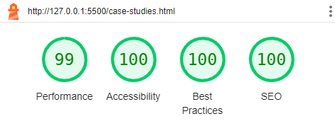
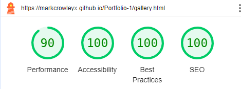

# TESTING 
---
## GEOCHRON LTD. - TESTING DOCUMENTATION

Visit the deployed site here: [Geochron](https://markcrowleyx.github.io/Portfolio-1/)
---
## CONTENTS
- [AUTOMATED TESTING](#automated-testing)
  - [W3C Validator](#w3c-validator)
  - Solved Bugs
  - Known Bugs
  - [Lighthouse](#lighthouse)
- [MANUAL TESTING](#manual-testing)
  - [Full Testing](#full-testing)
  - [Responsivness](#responsivness)
  ## AUTOMATED TESTING
  
  ### W3C Validator
  [W3C](https://validator.w3.org/) was used to validate the HTML of all pages of the website, as well as the CSS.
  
  - [Index page W3C HTML Validation](docs/testing/HTML-checker.png) - Pass
  - [Case-Studies page W3C HTML Validation](docs/testing/Html-checker-case-studies-page.png) - Pass
  - [Gallery page W3C HTML Validation](docs/testing/HTML-checker-gallery.png) - Pass
  - [Contact page W3C HTML Validation](docs/testing/HTML-checker-contact-page.png) - Pass
  - [Confirmation page W3C HTML Validation](docs/testing/HTML-checker-confirmation-page.png) - Pass
  - [style.css CSS Validation](docs/CSS-validator-gallery.png) - Pass
---
### Lighthouse
Lighthouse from the Chrome Developer tools was used to test the performance, accessibility, best practices and SEO of each page on the website.
### Desktop Results
- Index page

  
- Case-Studies page 

  
- Gallery page

  
-Contact page

  
- Confirmation page

  
### Mobile Results

- Index page

  
- Case Studies page

  
- Gallery page

  
- Contact page

  
- Confirmation page

  
## MANUAL TESTING
  Testing was continuous throughout the entire project build. Chrome developer tools were used to find and solve issues during the development.
### Testing User Stories
`client goals`
|Goals|Testing|
|:---|:---|
|To be able to view the website on a variety of device sizes.|The site has been checked on various sizes of devices, and has been found to perfom well on all sizes tested.|
|To provide an clear overview of the Quarry Survey Project|A thorough description of the survey project has been given, as well as a variety of images outputted from quarry surveys, and a description of the common applications arising from the use of the information generated.|
|To allow people to contact Geochron Ltd. to ask questions, and to request further information about the other services provided|The contact form provides the user with the means to request further information by using check boxes on the form.|
|To provide a means of requesting a survey.|The user can request a survey directly from the contact form using a check box.|

`First Time Visitors`
|Goals|Testing|
|:---|:---|
|I want to find out about what Geochron Ltd. does, and what the Quarry Survey Project is about.|There is a clear description about the company, as well as a detailed description about the Survey project.|
|I want to navigate the website easily and view the information.|There is a navbar at the top of each page which permits easy navigation within the website. On the `Thank you` page the navbar remains visible and the user can easily return to any page they wish, or return to the landing page directly by clicking on the company name.|
|I want to see examples of surveys which have already been completed.|There are a variety of images from surveys that have been conducted, as well as a map of Ireland showing the location of quarries, many of which have already been surveyed.|
|I want to find their Social media links|The social media links are located in the footer of each page, and open the respective link in a new tab.|

`returning visitors`
|Goals|Testing|
|:---|:---|
|I want to see the updated maps.|The site map of the quarries in the survey is updated whenever a new quarry is added.|
|I want to be able to request a survey|The users may request a survey simply by checking the relevant box on the contact form.|
---
### Full Testing
Full testing was performed on the following devices:
- Laptop
  - HP EliteBook 840G3 14 inch screen
- Mobile devices:
  - Samsung Galaxy J6+
  - Alcatel 1S

Each device was tested using the following browsers:

- Google Chrome
- Firefox

Family also helped with this testing, and reported that all features function as they should.

#### Mobile devices
---
|Feature|Expected outcome|Testing performed|Result|Pass/Fail|
|:---|:---|:---|:---|:---|
|The site's title|Link directs user back to site's landing page|Clicked title|Landing page reloads|Pass|
|Navbar|Links direct user to specified page|Click each link while on each page|User is directed to corresponding page.|Pass|
|Social media links in footer|Links direct user to respective site on a new page|Click on links while on each page|Link to specified social media opens in new tab.|Pass|
|Links on Case studies page|Links direct user to the corresponding website|Click on links|Link opens in new tab|pass|
|Input fields on contact form all have input validation, and are required to be filled before submitting.|Form cannot be submitted without filling all required fields, an email address must be entered in the corresponding input field, a number must be entered in the phone number field.|Attempt to submit the form without filling the required fields, attempt to input text in the phone number input field.|The form cannot be submitted without the required data, the phone number field will not accept text, the email field requires an email address to be entered before submitting is possible.|Pass|
---
#### Larger screens
In addition to all of the above, on larger screens there are the following features on the contact form which were also tested:
|Feature|Expected outcome|Testing performed|Result|Pass/Fail|
|:---|:---|:---|:---|:---|
|Text input boxes hover over|Border changes to red.|Hover cursor over input field|Border highlights in red colour|Pass
|Text input box: Input text|Placeholder text is replaced and background changes to white|Input text|Placeholder text is replaced and backround changes to white|Pass|
|Checkboxes hover over|Change colour to green, cursor changes to a pointer|Hover over checkboxes|Colour changes to green|Pass|
|Checkboxes checked|Change colour to blue with a white tick|Click checkboxes|Changes colour to blue with a wite central tick|Pass|
|Send Request button hover over|Change colour to white with red text, cursor changes to a pointer|Hover over|Button changes to wite with red text and cursor changes into a pointer|
---
## Responsivness
  Each page has been inspected on chrome developer tools and Firefox developer tools, ensuring that the pages are fully responsive on a variety of screen sizes. The site has also been physically tested on a wide range of different devices.

  

  - Galaxy fold index page

- ipad mini index page

- Galaxy fold Case studies page

- iPad mini case studies page

-Galaxy fold gallery page

- iPad mini gallery page

-Galaxy fold contact page

- iPad mini contact page

- Galaxy fold confirmation page

- iPad mini confirmation page

### Responsivness summary
||Galaxy Fold|Galaxy J6+|iPad mini|HP Elitebook|Desktop > 1200px|
|:--|:--|:--|:--|:--|:--|
|Site is responsive less than 700px|Good|n/a|n/a|n/a|n/a|
|Site is responsive over 700px|n/a|Good|Good|Good|Good|
|Images work as expected|Good|Good|Good|Good|Good|
|Links/URLs work as expected|Good|Good|Good|Good|Good|
|Renders as expected|Good|Good|Good|Good|Good|

Back to [README.md](README.md)

